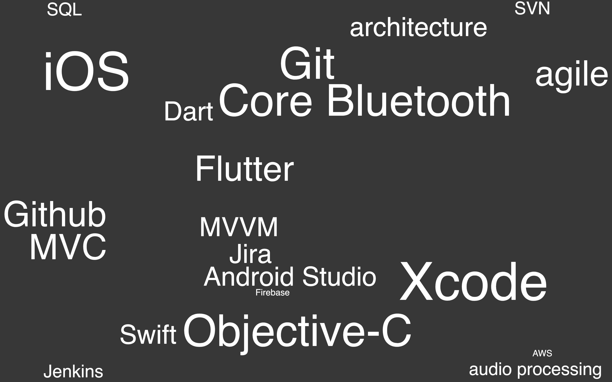

<html>  
  <body>
    

      

        

          
Alain Hsu

        

        

          
October 2021

        

      

      

        

        

          AIMA 
          NOA labs 
          Tymphany 
        

      

      

      

      

    

  </body>
</html>

<h1 style="color:#7F7F7F">Summary</h1>

This is a portfolio of several iOS apps I have worked on.

I have 6 years of software development experience, mostly on the Apple platform. 